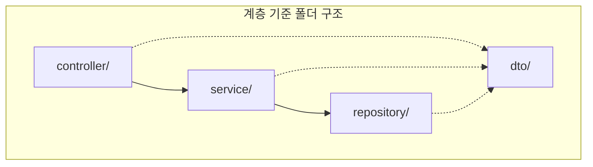
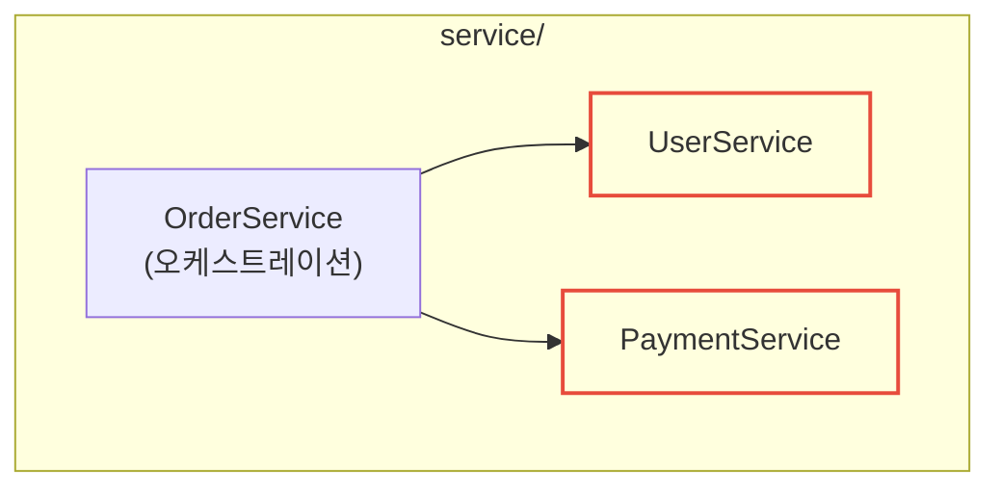
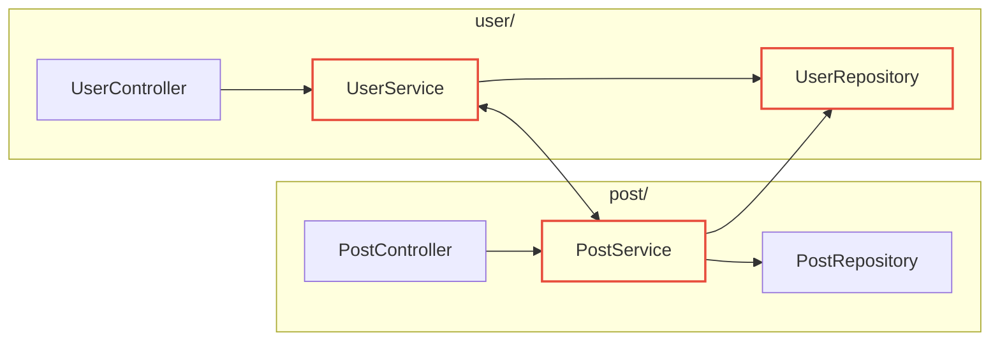
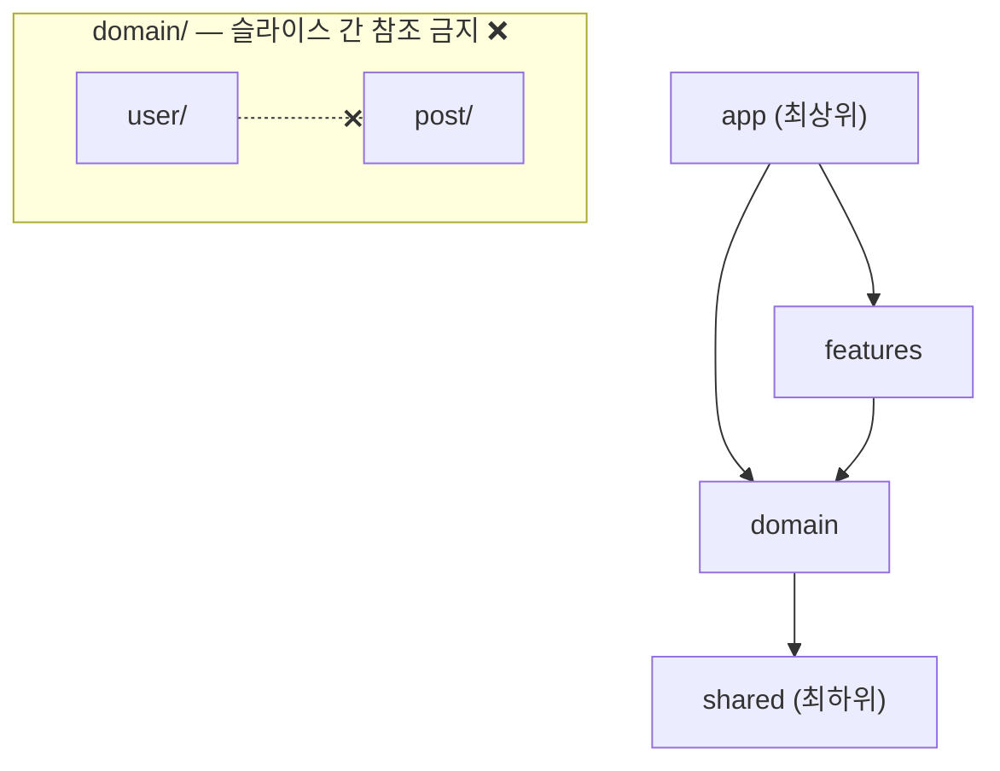
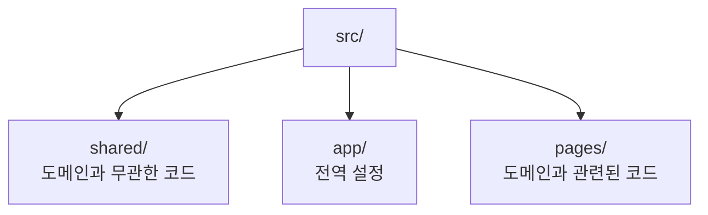
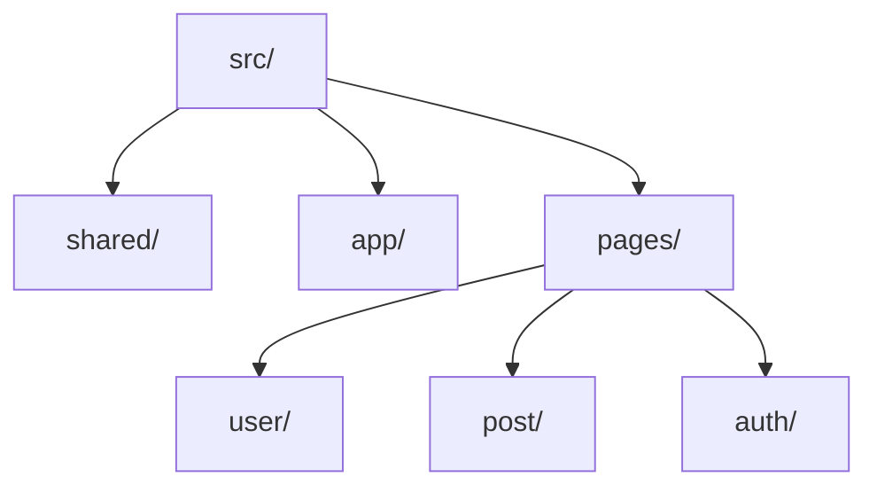
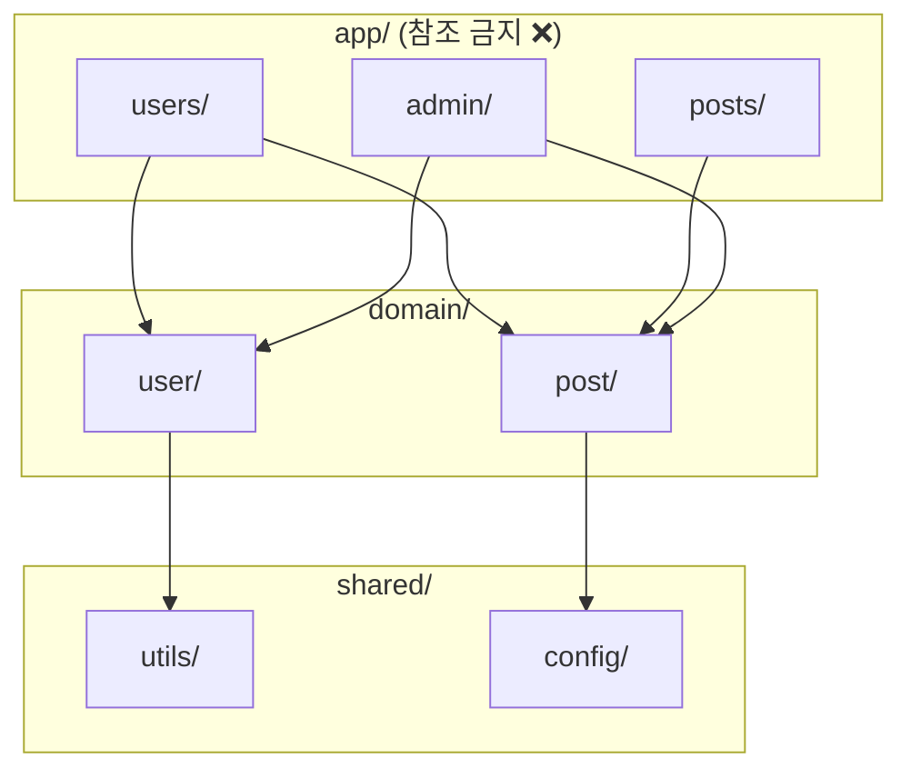
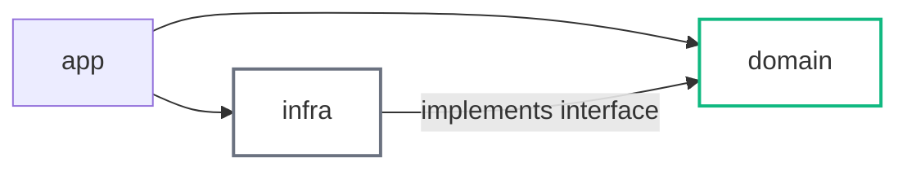

프로젝트 폴더 구조에 대해 진지하게 고민해본 적이 있나요? 이 글은 웹 개발을 주제로 합니다. 굳이 구분하자면 백엔드에 가깝지만, 독립적인 프로젝트로 개발하는 현대 프론트엔드라면 이야기는 크게 다르지 않습니다.

개발자들은 코드의 품질을 높이기 위해 객체지향 설계 기법과 디자인 패턴을 고민합니다. 그런데 의외로 폴더 구조에 대해서는 좋은 코드를 작성하는 방법만큼이나 깊은 논의가 없습니다. 코드가 전자 부품이라면, 프로젝트 폴더 구조는 회로 설계입니다. 부품이 아무리 정밀해도 회로가 뒤엉켜 있으면 전류는 엉뚱한 곳으로 흐릅니다. 코드도 마찬가지입니다. 개별 코드의 품질이 아무리 좋더라도, 폴더 구조와 참조 방향이 뒤엉켜 있으면 프로젝트 전체가 길을 잃습니다.

코드는 결국 파일 안에 담기고, 파일은 관심사에 따라 폴더로 묶입니다. 그렇다면 그 폴더를, 그리고 폴더 간의 참조 방향을 어떤 기준으로 설계해야 할까요?

## 계층(Layer) 기준으로 나누기

가장 먼저 접하는 방식은 애플리케이션 아키텍처를 기준으로 폴더를 나누는 것입니다. 레이어드 아키텍처에서 각 계층은 명확한 역할을 가지며, 그 역할에 따라 폴더가 구성됩니다.

| 레이어 | 역할 | 폴더 예시 |
|--------|------|-----------|
| Presentation Layer | HTTP 요청 처리, 응답 반환 | `controller/` |
| Application Layer | 비즈니스 로직 조율 | `service/` |
| Persistence Layer | 데이터 저장 및 조회 | `repository/` |

레이어드 아키텍처 자체가 이런 물리적 구조를 강제하는 건 아닙니다. 하지만 계층 간 단방향 흐름이라는 명확한 원칙이 있기 때문에 느낌대로 구성해도 처음에는 문제가 없습니다. 구성이 쉽고, 코드의 큰 흐름이 눈에 보입니다.



하지만 프로젝트가 커지면 단점이 드러나기 시작합니다.

도메인에 관련된 코드들이 여러 폴더에 파편화되고 유저 관련 코드를 수정하려면 `controller/`, `service/`, `repository/`, `dto/` 등을 전부 돌아다녀야 해요. 이건 이 구조에서 어찌 보면 당연한 단점입니다.

진짜 문제는 같은 레이어 안에서 생깁니다. `service` 폴더 안에서도 여러 서비스를 조율하는 오케스트레이션 서비스와, 단일 업무를 담당하는 서비스는 성격이 다릅니다. 하지만 같은 폴더 안에 나란히 놓여 있어요. 같은 레이어 안에서 서로를 참조하는 순간, 뭔가 찜찜한 느낌이 듭니다. 뭐가 상위이고 뭐가 하위인지, 방향이 흐려지는 거죠.



DTO에서는 이 문제가 더 두드러집니다. DTO는 `controller`, `service`, `repository` 어디서든 가져다 쓸 수 있는 공용 폴더의 성격을 가지면서도, 본질적으로는 특정 도메인에 응집되어야 합니다. 가장 많이 생성되는 파일 유형임에도 불구하고, 유형 기준으로만 묶어두면 도메인별 하위 분류 없이는 파일을 찾는 것조차 힘들어집니다. 게다가 요청에서 들어온 DTO가 흐름의 끝까지 그대로 쓰인다는 보장도 없습니다. 각 레이어에서 가공한 DTO가 생길 수 있고, 그걸 나누는 기준은 점점 모호해집니다.

## 기능(Feature) 기준으로 나누기

계층이 아니라 기능(feature) 단위로 폴더를 나누는 접근도 있습니다. NestJS를 접해보면, 프레임워크가 이 방향을 권장하고 있다는 걸 알 수 있어요. `user/`, `post/`, `auth/` 처럼 각 기능의 폴더가 자신에게 필요한 controller, service, repository, dto등을 모두 품고 있는 구조입니다.

도메인 응집도는 확실히 높아집니다. 유저 관련 코드를 수정할 때 `user/` 하나만 보면 되니까요. 하지만 이 방식은 기능들이 서로 협력하는 상황에서는 불리합니다.

각 기능이 프로세스 안에서 독립적으로 돌아가면 좋겠지만, 현실은 다릅니다. `UserService`가 `PostService`를 참조하거나, 한 도메인의 모델이 다른 도메인의 모델을 참조하는 일은 흔합니다. 어떤 서비스가 다른 기능의 repository를 직접 참조하는 경우도 있습니다. 이런게 괜찮은 건지 찜찜해 하면서도, 스스로 규칙을 만들어 일단은 허용합니다.



계층형 구조는 명확한 수직적 레이어를 통해 역할과 책임을 분리하지만, 기능형 구조는 기능 내부의 응집에만 몰입한 나머지 도메인 간 경계를 넘나드는 상호작용이 발생할 때 이를 제어할 표준 가이드라인이 없어 아키텍처가 비대칭적으로 변질됩니다.

## 클린 아키텍처는 답인가?

우리는 이런 문제가 발생하면 일단 클린 아키텍처를 찾습니다. 과연 클린아키텍처는 우리가 마주한 이 구조적인 찜찜함을 해결해 줄, 정말 좋은 대안이 될 수 있을까요?

> [!IMPORTANT]
> **클린 아키텍처의 본래 목적은 폴더 구조가 아닙니다.** 핵심은 도메인 영역의 순수성입니다. 비즈니스 규칙과 유즈케이스가 외부 세부사항 — 프레임워크, 데이터베이스, UI, 외부 서비스 — 에 의존하지 않도록 설계하는 것이에요. 이 원칙을 어떻게 폴더로 표현할 것인가는 전적으로 해석의 영역입니다.

로버트 마틴의 [원문](https://blog.cleancoder.com/uncle-bob/2012/08/13/the-clean-architecture.html)을 다시 한번 살펴보면 흥미로운 점이 있습니다.


이 유명한 동심원 다이어그램은 **의존성 방향의 원칙**을 설명해요. 바깥 원은 안쪽 원을 참조할 수 있지만, 안쪽 원은 바깥을 몰라야 한다는 거죠. 원칙 자체는 명확합니다. 하지만 원문 어디에도 프로젝트의 폴더를 어떻게 나눠야 하는지, 폴더 안에 코드를 어떻게 배치해야 하는지는 언급되지 않아요. 이 부분은 전적으로 개발자의 해석에 맡겨져 있습니다.

그래서인지 같은 클린 아키텍처를 표방하면서도 프로젝트마다 폴더 구조가 제각각이에요. 해석이 다양한 것 자체가 나쁜 건 아니에요. 다만 한 가지 점검해볼 건 있습니다 — 그 해석으로 만들어진 폴더 구조가 일관된 규칙이 지켜지고 있는지요.

코드간의 의존 방향만큼 중요한 것이 폴더간의 의존 방향입니다. 폴더 간에 양방향 참조가 존재하거나, 같은 레벨의 폴더가 서로를 참조하고 있다면 — 그 이유를 명확하게 설명할 수 있어야 해요.

## 구조를 해석하는 능력을 기르기

의미 있는 폴더 이름을 짓는 것도 중요합니다. 하지만 더 근본적인 질문이 있어요.

**파일들이 어떤 기준으로 분류되고 있는가, 그리고 그 폴더들 사이의 참조 방향이 일관성 있게 유지되고 있는가.**

이 두 가지를 명확하게 대답할 수 없다면, 폴더 이름이 아무리 직관적이어도 구조는 결국 흔들립니다.

저는 이 문제의 정답을 [FSD(Feature-Sliced Design)](https://feature-sliced.design/kr/docs/get-started/overview)에서 찾았습니다.


FSD는 프론트엔드 아키텍처 방법론입니다. FSD는 폴더를 세 가지 단위로 구분합니다.

| 단위 | 설명 | 예시 |
|------|------|------|
| **레이어(Layer)** | 최상위 폴더. 전체 구조의 계층을 나눈다 | `app/`, `features/`, `shared/` |
| **슬라이스(Slice)** | 레이어 안에서 도메인(비즈니스 요구사항)으로 나눈 폴더 | `features/user/`, `features/post/` |
| **세그먼트(Segment)** | 슬라이스 안에서 역할(기능)별로 나눈 폴더 | `api/`, `model/`, `ui/` |

"프론트엔드 방법론인데 백엔드에 억지로 녹이는 거 아닌가?" — 타당한 의문이에요. 맞아요, FSD는 프론트엔드 방법론입니다. `pages`나 `widgets` 같은 이름을 백엔드 프로젝트에 그대로 쓸 이유는 없죠. 그런데 FSD를 깊이 보면, 핵심은 `app`, `pages`, `features` 같은 **폴더 이름이 아닙니다.**

클린 아키텍처도 의존성 방향이라는 명확한 원칙을 제시하지만, 실제로 폴더를 어떻게 나눌지는 해석에 맡겨져 있어요. FSD는 거기서 한 발 더 나아가서 레이어 이름과 슬라이스 개념을 직접 정해두고 어느 정도 강제성을 부여합니다. 팀마다 해석이 달라지는 여지가 줄어드는 거죠.

그보다 더 중요한 건 — **FSD는 물리적인 폴더의 참조 관계를 설명할 수 있는 언어를 제공합니다.** 이 언어를 이해하고 자신의 프로젝트에 녹인다면, FSD의 폴더 이름을 그대로 쓰지 않더라도 폴더 구조의 오류를 발견하고 수정할 수 있어요.

> [!NOTE]
> 이 글에서 쓰는 `domain`, `app`, `features`, `infra` 같은 레이어 이름은 개념을 설명하기 위한 예시입니다. 특정 명칭을 그대로 써야 한다는 의미가 아니에요. 중요한 건 이름이 아니라 참조 방향에 대한 사고방식입니다.

## Layer Import Rule과 Public API 규칙

FSD가 제시하는 규칙 중, 딱 두 가지만 이해해도 폴더 설계 방식의 큰 틀이 잡힙니다.

### Layer Import Rule

[FSD 레이어 문서](https://feature-sliced.design/kr/docs/reference/layers#import-%EA%B7%9C%EC%B9%99)에 따르면, 레이어 간 참조에는 두 가지 규칙이 있습니다.

첫째, **레이어 간 참조는 항상 단방향이어야 합니다.** 상위 레이어는 하위 레이어를 참조할 수 있지만, 그 반대는 안 됩니다.

둘째, **같은 레이어 내의 슬라이스(폴더)끼리는 서로를 참조할 수 없습니다.** (`shared` 레이어는 예외)



두 번째 규칙이 핵심이에요. 계층 기준 구조에서는 같은 `service/` 안에서 서로 참조가 발생했고, 기능 기준 구조에서는 `user/`와 `post/`가 서로를 import했습니다. Layer Import Rule은 이 문제에 명확한 답을 제시해요 — 같은 레이어에 있다면 서로 참조하면 안 됩니다. 참조가 필요하다면 공유 대상을 더 하위 레이어로 내려야 합니다.

### Public API 규칙

[FSD Public API 문서](https://feature-sliced.design/kr/docs/reference/public-api)에 따르면, 각 슬라이스(폴더)는 외부에 공개할 것만 명시적으로 내보냅니다. 외부에서는 이 공개 API를 통해서만 접근할 수 있고, 내부 파일을 직접 참조하는 건 금지됩니다.

핵심은 **외부 코드가 슬라이스의 내부 구조를 알 필요가 없다**는 거예요. 인터페이스와 같은 효과입니다. 내부가 어떻게 구성되어 있든 — 파일 이름이 바뀌든, 내부 구조가 재편되든 — 공개 API만 유지된다면 외부에는 아무런 영향이 없습니다.

Layer Import Rule은 대부분의 프로젝트에 일관되게 적용하기 좋습니다. 하지만 슬라이스 내부는 다릅니다. 기능 파일들이 밀집한 곳에서는 예외 케이스가 많고, 규칙을 세워도 또 다른 오류가 나오기 쉬운 복잡한 영역이에요. Public API 규칙은 여기서 유연성을 제공합니다 — 내부 구조에 대한 엄격한 규칙 대신, 외부와의 경계선을 명확히 정의하는 방식으로요.

---

이 두 규칙만 이해해도 폴더 설계의 큰 틀이 잡힙니다. "이 파일을 어디에 두면 좋을까?", "이 참조가 허용되는 방향인가?"라는 질문에 스스로 답할 수 있게 돼요.

## 레이어 기준과 기능 기준, 둘 다 쓴다

앞서 계층 기준과 기능 기준을 각각 살펴봤어요. 이제 그 질문을 다시 꺼내봅시다. "그래서 결국 둘 중 어떤 기준으로 폴더를 나눠야 하나요?"

정답은 **둘 다 씁니다 — 적용되는 영역이 다를 뿐**입니다.

실마리는 FSD의 `shared` 레이어에 있어요. `shared`에는 어떤 코드가 들어갈까요? 날짜 포맷팅 유틸리티, 환경 변수 설정, 공통 상수, 범용 타입 정의 같은 것들이에요. 공통점이 하나 있습니다 — 이 코드들은 **어떤 도메인, 어떤 기능과도 무관합니다.** 프로젝트가 쇼핑몰이든 블로그든, `formatDate` 함수는 똑같이 생겼어요.

여기서 폴더 설계의 첫 번째 분류 기준이 생깁니다.

- **도메인과 무관한 코드** — 어느 프로젝트에서도 비슷하게 쓰이는 유틸리티, 설정, 공통 기반 → `app`,`shared`
- **도메인과 관련된 코드** — 이 서비스의 비즈니스에 특화된 모든 코드 → `pages`, `features` 등



이 분류는 **레이어 기준**입니다. 그리고 `pages` 안을 세분화할 때 비로소 **기능(도메인) 기준**을 적용합니다.



레이어 우선, 그 안에서 슬라이스. 이게 FSD가 제시하는 폴더 설계의 기본 골격이에요. 두 기준이 충돌하는 게 아니라, 적용되는 범위가 다릅니다.

### shared와 app은 슬라이스가 없다

[FSD 문서](https://feature-sliced.design/kr/docs/reference/slices-segments)에 따르면, `shared`와 `app`은 다른 레이어와 구조가 다릅니다. 나머지 레이어에는 슬라이스(도메인 단위 폴더)가 있지만, 이 두 레이어는 **세그먼트로만 구성**됩니다.

- `shared`는 비즈니스 로직이 없기 때문에 도메인 단위로 나눌 이유가 없습니다. `utils/`, `config/`, `constants/` 같은 기술적 역할 기준의 세그먼트로 구성됩니다.
- `app`은 애플리케이션 전체를 초기화하는 최상위 설정을 담습니다. 서버 진입점, 전역 미들웨어, 루트 모듈처럼 도메인 슬라이스가 직접 참조하지 않는 코드들이에요. 하나의 애플리케이션에 하나뿐이므로 슬라이스로 나눌 이유가 없습니다.

슬라이스가 없다는 건 세그먼트 간의 협력이 허용된다는 의미이기도 해요. 다른 레이어에서 슬라이스들이 서로를 참조하면 안 되는 것과 달리, `shared`의 `utils/`는 `config/`를 참조할 수 있습니다. 다만 양방향 참조가 생기지 않도록 관리하는 건 여전히 개발자의 몫이에요.

---

이 글 아래에서 사용하는 `app/` 폴더는 FSD의 `app` 레이어와 다릅니다. **여기서 `app/`은 프레젠테이션과 비즈니스 로직이 아직 혼재된 애플리케이션 레이어 전체를 가리키는 표현이에요** — FSD의 `pages`나 `features`에 더 가깝습니다.

## 점진적인 설계 기법

처음부터 완벽한 구조를 만들 필요는 없어요. 복잡도가 실제로 문제가 될 때 단계적으로 개선하면 됩니다.

### 1단계: domain 레이어 분리

`app` 레이어 내부 폴더들이 서로를 참조하기 시작하면, 그 원인이 되는 것들을 `domain` 레이어로 꺼냅니다. ORM 엔티티, 도메인 모델, Repository 인터페이스, 다른 도메인에 의존하지 않는 핵심 서비스 등이 여기 해당해요.

```
src/
├── app/
│   ├── users/        // Controller + 오케스트레이션 Service
│   ├── posts/
│   └── admin/
├── domain/           // 새로 분리한 레이어
│   ├── user/
│   │   ├── index.ts
│   │   ├── user.entity.ts
│   │   ├── user.repository.ts   // 인터페이스
│   │   └── user-core.service.ts
│   └── post/
└── shared/
```

이렇게 분리하면 `app` 레이어에 **내부 폴더 간 참조 금지** 규칙을 적용할 수 있어요. 폴더 간에 공유해야 할 것들이 이미 `domain`으로 이동했으니까요.



또 다른 장점이 생겨요. `app` 레이어가 이제 API 리소스 구조를 명확하게 표현할 수 있습니다.

```
app/
├── users/
├── posts/
├── auth/
├── admin/
│   ├── users/
│   ├── posts/
│   └── dashboard/
├── home/
└── feed/
```

폴더 구조만 봐도 "이 애플리케이션이 어떤 인터페이스를 제공하는가"가 한눈에 보여요.

> [!NOTE]
> 여기서 말하는 `domain` 레이어는 클린 아키텍처나 DDD의 "순수한 도메인 레이어"와는 달라요. Repository 구현체가 있어도 되고, ORM 엔티티를 직접 써도 됩니다. 중요한 건 `app` 레이어에서 재사용 가능한 핵심 로직을 분리한다는 실용적인 목적이에요.

### 2단계: features 레이어 — 재사용되는 유즈케이스

`app` 레이어의 여러 폴더에서 같은 비즈니스 로직이 필요해지는 순간이 와요. 예를 들어 "게시글 작성" 기능이 일반 사용자 API(`/posts`)와 관리자 API(`/admin/posts`)에서 모두 필요한 경우입니다.

이 로직을 `domain`에 넣기엔 너무 상위 레벨의 비즈니스 흐름이고, `app`에 두자니 재사용이 안 돼요. 그래서 그 사이에 `features` 레이어를 둡니다.

```
src/
├── app/
├── features/
│   ├── create-post/
│   │   ├── index.ts               // public API
│   │   ├── create-post.service.ts
│   │   └── create-post.dto.ts
│   ├── delete-user/
│   └── send-notification/
├── domain/
└── shared/
```

## OOP의 의존성 역전 원칙과 폴더 참조관계

한 가지 오해를 미리 풀고 싶어요. 아래에서 설명하는 구조에서 양방향 참조가 발생하는 게 아닙니다. 화살표의 방향이 다를 뿐이에요.

---

`features` 레이어는 그 자체만으로도 충분히 가치 있습니다. `app` 레이어의 여러 슬라이스에서 재사용해야 하는 비즈니스 로직을 분리해두는 것만으로도 구조가 훨씬 명확해지거든요. 여기서 한 발 더 나아갈 수 있어요. OOP의 **의존성 역전 원칙(DIP)** 을 폴더 참조 관계에 적용하는 겁니다.

현재 구조에서 `domain` 레이어는 도메인 모델과 함께 Repository 구현체도 가지고 있어요. `domain`이 DB, 즉 인프라 세부사항에 의존하는 셈입니다. 이게 당장 문제가 되지 않더라도, 테스트하기 어렵고 인프라를 교체하기도 어려워집니다.

DIP를 쓰면 이 방향을 뒤집을 수 있어요. `domain`에는 인터페이스만 두고, 구현체는 `infra` 레이어로 꺼냅니다.

```
domain/
└── user/
    ├── user.entity.ts
    └── user.repository.ts        // 인터페이스만 정의

infra/
└── repositories/
    └── user.repository.impl.ts   // domain의 인터페이스를 implements
```



물리적인 import 방향은 `infra → domain`이에요. `infra`가 `domain`의 인터페이스를 가져다 구현합니다. `domain`은 `infra`를 전혀 모르고요. 결과적으로 의존 방향은 `app → domain ← infra`가 됩니다.

양방향 참조처럼 보일 수 있지만 아닙니다. `app`이 `domain`을 바라보고, `infra`도 `domain`을 바라봅니다. `domain`은 아무것도 바라보지 않아요. 화살표의 목적지가 같을 뿐, 방향은 모두 `domain`을 향하고 있습니다.

DB 엔진을 교체하거나 외부 API 연동 방식을 바꿔도 `domain` 레이어는 건드릴 필요가 없어요. 인프라 세부사항이 완전히 격리되어 있거든요.

## 그렇다면, 증명할 수 있는가

저의 포스팅도 하나의 해석입니다. 저의 포스팅도 하나의 해석입니다. 세상에는 많은 방법이 존재하고 그렇기 때문에 더 나은 구조가 분명 있습니다.

개발 커뮤니티에서는 어려운 개념을 단순하게 설명하는 아이디어가 빠르게 퍼지며 통념이 되곤 합니다. 누군가 책을 읽고, 자신의 해석을 제시하고, 글 몇 편과 저장소를 공유하면 어느새 그 해석이 표준처럼 굳어져요. 해석의 정확성보다 확산 속도와 글쓴이의 영향력이 더 크게 작동하는 경우도 적지 않습니다.

이 글에서 다루는 FSD도 그 흐름 속에 있어요. 특별한 존재가 아닙니다. 다만 FSD는 자신의 설계를 명시적인 규칙으로 문서화하고, 실제 프로젝트에서 검증하며, 커뮤니티의 피드백을 거쳐 발전해왔어요. 그 과정이 어느 정도의 신뢰를 만들어줬다고 생각합니다.

저도 같은 의심을 품었던 적이 있어요. 클린 아키텍처를 공부하면서 나만의 해석으로 폴더 구조를 만들어본 적이 있거든요. 나름 논리적이라고 생각했습니다. 그런데 다른 개발자와 논의하면서 생각보다 많은 오류를 발견했어요. 설명하지 못하는 부분도 있었고, 내 해석 자체가 틀린 것도 있었습니다. 결국 그 구조는 포기했어요. 그때 느낀 건, 아직 한참 부족하다는 거였어요.

폴더 구조에 정답은 없습니다. 하지만 어떤 방법이든 분명 **규칙은 있어야 합니다.** 그리고 그 규칙을 정확히 정의할 수 있어야 합니다.

당신의 답은 무엇인가요?