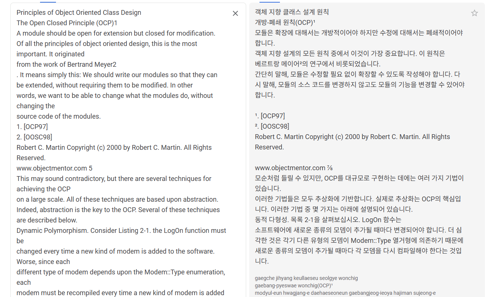

원칙이란 일관되게 지켜야 하는 기본적인 규칙이나 법칙을 말한다. SOLID 원칙은 객체지향 프로그래밍을 하는 개발자라면 당연히 지켜야 하는 규칙이다. 이 명제는 한동안 나를 지배했었다. 하지만 비용이라는 벽을 만나며, 규칙을 깨는 범법자가 될 수밖에 없는 상황들을 마주하게 되었다.

현재 개발에 드는 시간과 미래의 유지보수 비용. 어느 쪽에 무게를 둘 것인가에 따라 원칙은 지켜지기도, 깨지기도 하였다. 이 글은 그 저울질 끝에 내가 내린 결론에 대한 이야기다.

## "책임"은 누가 정하는가

SOLID 원칙 중 나를 가장 오랫동안 괴롭혀온 것은 단일 책임 원칙(Single Responsibility Principle)이다. 클래스는 하나의 책임만 가져야 한다. 모듈이 변경되는 이유는 하나여야 한다. 유지보수성을 위해... 그래, 대략 무엇을 말하는지는 알겠다. 컨트롤러는 요청을 받고, 서비스는 비즈니스 로직을 처리하고. 너무 당연한 말이다.

웹 개발에서 범용적으로 쓰이는 레이어나 정해진 디자인 패턴 같은 코드들은, 오랜 시간 쌓여온 관례를 통해 판단할 수 있는 근거가 있다. 그래서 단일 책임 역시 설명이 되는 듯했다.

하지만 관례가 닿지 않는 곳은 존재한다. "책임"이라는 단어는 너무 주관적이기 때문이다. 어느 날, 어떤 클래스를 두고 책임에 대한 논의가 이어졌다. 내가 이해하는 단일 책임을 명쾌하게 설명할 수 있어야 했는데, 그러지 못했다. 같은 문제를 비슷하게 바라보고 있으면서도, 정작 "왜 이것이 하나의 책임인가"를 증명할 수 없었다. 나는 단일 책임 원칙을 안다고 착각하고 있었을 뿐이다.

## SOLID 원칙은 부메랑처럼 돌아온다

주니어 시절, Java를 배우며 SOLID 원칙을 자연스럽게 알게 되었다. 당시 스택오버플로우에서 이 원칙을 두고 의견이 대립하는 글을 읽었고, "필요에 따라 적용하면 된다"는 누군가의 댓글에 안도감을 느끼며 빠르게 타협을 내렸다.

어떤 단어의 줄임말인지, 각 원칙의 이름과 설명, 면접에서 물어볼까 봐 달달 외워둔 대략적인 예시. 그 이상은 큰 관심사가 아니었다. 부끄럽게도.

몇 년이 흐르고, 우매함의 봉우리에서 절망의 계곡으로 곤두박질쳤을 때 SOLID 원칙에 대한 궁금증은 부메랑처럼 돌아왔다. 마치 이제야 진실의 단편을 맛볼 준비가 되었다는 듯이.

블로그와 유튜브에서 알려주는 정보로는 갈증을 해결할 수 없었다. 개방 폐쇄부터 의존성 역전까지, 나머지 원칙들은 회사 프로젝트와 개인 프로젝트를 진행하며 차츰 원리를 깨달아갔지만(반쯤은 착각이다), 단일 책임 원칙만큼은 진정으로 이해할 수 없었기 때문이다. 유튜브에는 로버트 마틴이 직접 설명하는 영상도 있었지만, 영어를 못하는 나는 느린 번역과 오역을 견디지 못하고 포기했다. 

결국 로버트 C. 마틴의 [논문](https://web.archive.org/web/20150906155800/http://www.objectmentor.com/resources/articles/Principles_and_Patterns.pdf)까지 거슬러 올라갔다. 구글 번역기를 돌려가며 한 문장씩 읽어 내려갔고, 몇 년간 무지했던 자신과의 싸움 끝에 — 한 번 더 절망을 맛보았다. 논문 어디에도 단일 책임(Single Responsibility)이라는 원칙이 없었기 때문이다.

논문의 "Principles of Object Oriented Class Design" 섹션에서 다루는 원칙은 OCP(Open Closed Principle), LSP(Liskov Substitution Principle), DIP(Dependency Inversion Principle), ISP(Interface Segregation Principle) 뿐이었다. 내가 제일 궁금했던 부분이 나를 농락하기라도 하듯 보이질 않으니, 미칠 지경이었다.

*(당시 번역기를 돌리다가 OCP가 SRP 보다 먼저 나와서 당황하며, 앞뒤로 "Single", "SRP"를 검색하며 절망했던 순간을 재현)*

한참 뒤에 알게 된 사실인데, SOLID라는 약어는 로버트 마틴이 만든 것이 아니었다. 마이클 페더스(Michael Feathers)가 로버트 마틴에게 "이 원칙들의 앞글자를 따면 SOLID가 된다"고 이메일로 제안하면서 탄생한 이름이다. 단일 책임 원칙은 로버트 마틴이 이후 저서에서 별도로 정리한 원칙이었고, 이 논문에는 애초에 존재하지 않았던 것이다.

## 유레카는 미묘하게 찾아온다

어린 시절, 두발자전거를 처음 탔을 때의 기억이 있다. 몇 번이고 넘어지고, 아무리 발버둥 쳐도 그날은 끝내 타지 못했다. 그런데 며칠 뒤, 아무 기대 없이 다시 올라탔을 때 마법처럼 페달이 돌아갔다. 레미니센스 효과라고 한다. 학습 직후보다 시간이 지난 뒤에 오히려 수행이 향상되는 현상이다.

한동안 내 뇌는 단일 책임 원칙에 대해 찾아보는 행위 자체를 거부했다. 자포자기였던 것 같다.

하지만 논문을 읽었던 행위는 나도 모르게 새로운 방향을 심어두고 있었다. 논문에는 블로그나 유튜브에서는 볼 수 없었던 것이 있었다. 저자의 철학. 로버트 마틴이 왜 이 글을 썼는지, 무엇이 그를 움직였는지가 행간에 배어 있었다.

논문은 2000년에 나왔다. 제목은 "Design Principles and Design Patterns". 그런데 GoF의 Design Patterns는 이미 6년 전인 1994년에 출간되었다. 객체지향 언어는 그 자체로 유지보수성과 재사용성을 약속했고, 상황별 설계 해법도 어느 정도 정립된 시점이었다. 그럼에도 로버트 마틴이 이 논문을 써야 했다는 것은, OOP와 디자인 패턴만으로는 해결되지 않는 문제가 현실에 존재했다는 뜻이었다.