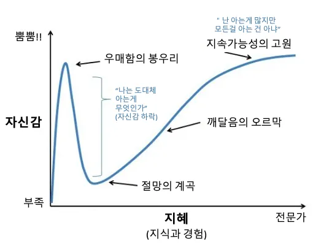

원칙이란 일관되게 지켜야 하는 기본적인 규칙이나 법칙을 말한다. SOLID 원칙은 객체지향 프로그래밍을 하는 개발자라면 당연히 지켜야 하는 규칙이다. 이 명제는 한동안 나를 지배했었다. 하지만 비용이라는 벽을 만나며, 규칙을 깨는 범법자가 될 수밖에 없는 상황들을 마주하게 되었다.

현재 개발에 드는 시간과 미래의 유지보수 비용. 어느 쪽에 무게를 둘 것인가에 따라 원칙은 지켜지기도, 깨지기도 하였다. 이 글은 그중에서도 단일 책임 원칙에 대해 나의 경험과 생각을 풀어가며, 그 저울질 끝에 내린 결론에 대한 이야기다.

## "책임"은 누가 정하는가

SOLID 원칙 중 나를 가장 오랫동안 괴롭혀온 것은 단일 책임 원칙(Single Responsibility Principle)이다. 클래스는 하나의 책임만 가져야 한다. 모듈이 변경되는 이유는 하나여야 한다. 유지보수성을 위해... 그래, 대략 무엇을 말하는지는 알겠다. 컨트롤러는 요청을 받고, 서비스는 비즈니스 로직을 처리하고. 너무 당연한 말이다.

웹 개발에서 범용적으로 쓰이는 레이어나 정해진 디자인 패턴 같은 코드들은, 오랜 시간 쌓여온 관례를 통해 판단할 수 있는 근거가 있다. 그래서 단일 책임 역시 설명이 되는 듯했다.

하지만 관례가 닿지 않는 곳에서는 논쟁이 일어난다. 특히 단일 책임 원칙은 개발 커뮤니티에서도 유독 의견이 갈린다. "책임"이라는 단어를 해석하는 기준이 사람마다 다르기 때문이다.

나 역시 그 논쟁 앞에 서야 했다. 어느 날, 내가 이해하는 단일 책임 원칙을 명쾌하게 설명해야 하는 순간이 왔다. 내 코드에 대한 확신은 있었다. 하지만 "왜 이것이 하나의 책임인가"를 증명할 수 없었다. 나는 단일 책임 원칙을 이해하는 척 하고 있었을 뿐이다.

## 내다 버린 의문은 부메랑처럼 돌아온다

주니어 시절, Java를 배우며 SOLID 원칙을 자연스럽게 알게 되었다. 당시 스택오버플로우에서 이 원칙을 두고 의견이 대립하는 글을 읽었고, "필요에 따라 적용하면 된다"는 누군가의 댓글에 안도감을 느끼며 빠르게 타협을 내렸다.

어떤 단어의 줄임말인지, 각 원칙의 이름과 설명, 면접에서 물어볼까 봐 달달 외워둔 대략적인 예시. 그 이상은 큰 관심사가 아니었다. 부끄럽게도.

몇 년이 흐르고, 우매함의 봉우리에서 절망의 계곡으로 곤두박질쳤을 때 SOLID 원칙에 대한 궁금증은 부메랑처럼 돌아왔다. 마치 이제야 진실의 단편을 맛볼 준비가 되었다는 듯이.

블로그와 유튜브에서 알려주는 정보로는 갈증을 해결할 수 없었다. 개방 폐쇄부터 의존성 역전까지, 나머지 원칙들은 회사 프로젝트와 개인 프로젝트를 진행하며 차츰 원리를 깨달아갔지만(반쯤은 착각이다), 단일 책임 원칙만큼은 진정으로 이해할 수 없었기 때문이다. 유튜브에는 로버트 마틴이 직접 설명하는 영상도 있었지만, 영어를 못하는 나는 느린 번역과 오역을 견디지 못하고 포기했다.

결국 로버트 C. 마틴의 [논문](https://web.archive.org/web/20150906155800/http://www.objectmentor.com/resources/articles/Principles_and_Patterns.pdf)까지 거슬러 올라갔다. 구글 번역기를 돌려가며 한 문장씩 읽어 내려갔고, 몇 년간 무지했던 자신과의 싸움 끝에 — 한 번 더 쓴맛을 맛보았다. 논문 어디에도 단일 책임(Single Responsibility)이라는 원칙이 없었기 때문이다.

논문의 "Principles of Object Oriented Class Design" 섹션에서 다루는 원칙은 OCP(Open Closed Principle), LSP(Liskov Substitution Principle), DIP(Dependency Inversion Principle), ISP(Interface Segregation Principle) 뿐이었다. 내가 제일 궁금했던 부분이 나를 농락하기라도 하듯 보이질 않으니, 미칠 지경이었다.

## 유레카는 미묘하게 찾아온다

어린 시절, 두발자전거를 처음 탔을 때의 기억이 있다. 몇 번이고 넘어지고, 아무리 발버둥 쳐도 그날은 끝내 타지 못했다. 그런데 며칠 뒤, 아무 기대 없이 다시 올라탔을 때 마법처럼 페달이 돌아갔다. 레미니센스 효과라고 한다. 학습 직후보다 시간이 지난 뒤에 오히려 수행이 향상되는 현상이다.

한동안 내 뇌는 단일 책임 원칙에 대해 찾아보는 행위 자체를 거부했다. 자포자기였던 것 같다.

하지만 그 논문은 예상치 못한 방향으로 자극을 주었다. 발번역된 한글 속에서도 로버트 마틴의 철학이 드러났고, 나는 어느새 그의 다른 저작과 배경을 추적하고 있었다. 그가 상당한 순수주의자라는 것, 그리고 그를 비판하는 측의 글들도 눈에 들어왔다. 물론 당시 SOLID의 S에도 머리를 싸매고 있던 나에게 그걸 판가름할 지혜 따윈 없었다.

다만 하나의 의문은 점점 선명해졌다. 내가 SRP를 어느 정도 이해하고 있는 거라면, 이 원칙은 너무 과한 것 아닌가. 그 불안감 위에, 단일 책임 원칙을 완벽하게 설명했다는 글, 반대로 그 한계를 지적하는 글, 자신만의 철학으로 재해석하는 글이 겹겹이 쌓였다. 다양한 시선을 접하면서 나 역시, 지금이라면 내 생각을 녹여낼 수 있을 것 같다.

## 내가 이해한 단일 책임 원칙의 정의

not yet.

## 그래서, 아름다운가?

나에게 많은 인사이트를 준 [글](https://sklivvz.com/posts/i-dont-love-the-single-responsibility-principle)이 있다. 저자는 SRP의 "하나"라는 숫자가 자의적이며, "책임"의 정의가 모호하고, 항상 분리만을 요구할 뿐 통합에 대한 지침은 없다고 지적한다. 대안으로 결합도와 응집도라는, 측정 가능한 기준을 제시한다.

나는 이 의견에 전적으로 동의한다. "단일 책임"이라는 하나의 원칙 아래 너무 거대한 흐름을 통제하려 드는 것. 솔직히 말하면, 내 마음속의 진짜 불편함은 따로 있었다. SOLID의 S로 존재한다는 것. S를 지키지 않으면 마치 SOLID 전체를 지키지 않는 것 같은 심리적 압박.

오늘날 개발자에게 SOLID는 이 짧은 단어 안에 많은 의미를 품고 있다. 필요에 따라 적용하면 객체지향을 이해하고 있다는 달콤한 착각에 빠지게 하는 OCP. "정사각형은 직사각형이다"라는 직관을 뒤집으며 계약의 의미를 깨닫게 해주는 LSP. 거대한 인터페이스를 클라이언트가 실제로 쓰는 만큼만 나누라는 ISP. 인터페이스 하나로 구현체를 갈아끼울 수 있다는 사실에 감동했던 DIP. 이 원칙들은 적용의 근거가 비교적 명확하다.

하지만 단일 책임 원칙은 다르다. 이게 맞다고 정의를 내리는 순간, 원칙을 지키고 싶지 않은 불순한 마음이 고개를 든다. 이것을 고수해야 한다는 주장과의 대립. 또는 이해의 차이에서 오는 끝없는 의견 불일치.

그런 점에서 단일 책임 원칙은 그다지 — 아름답지 않다.

## 단일 책임 원칙과 클린 아키택처

not yet.

## 순수주의와 실용주의

not yet.

## 마무리